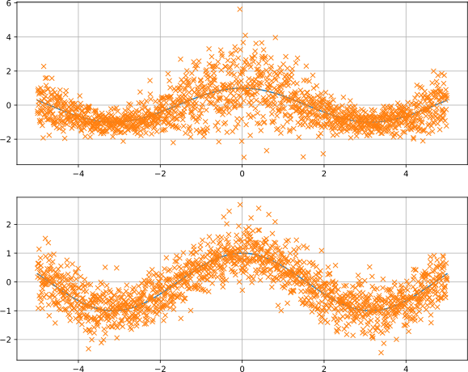
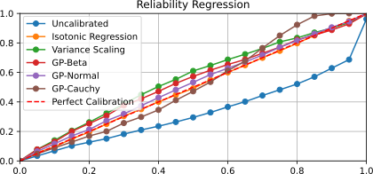

Artificial Regression Calibration Example
=========================================

In this package, we demonstrate the usage of the regression calibration methods provided by the *netcal* library.
The file *main.py* holds an artificial example that samples data around a cosine function with a certain mean and a variance.
The sampled variance can be set to depend on the mean (cosine value).
This is demonstrated in the following figure:

Each sample within the array *ymean* and *ystd* reflects a mean and stddev prediction by an artificial estimator.
The calibration methods are fit to the ground truth *y* using these estimates as inputs.
The following methods apply a recalibration on the cumulative (CDF) and thus output points on the CDF:

- Isotonic Regression
- GP-Beta

Using the function *cumulative_moments()*, it is possible to get a mean/stddev estimate by the provided CDF function.
The following methods apply a parametric recalibration (e.g., Gaussian, Cauchy):

- Variance Scaling
- GP-Normal
- GP-Cauchy

If we visualize the recalibrated distribution functions of the first sample, we get the following image:

.. image:: img/methods.svg
    :align: center

You can use Scipy's *norm* or *cauchy* module to get a density (PDF) or a CDF function.
Finally, we demonstrate how to use the metrics provided by the *netcal.metrics* package to measure regression calibration.
The following metrics are implemented:

- NLL
- Expected Normalized Calibration Error (ENCE)
- Uncertainty Calibration Error (UCE)
- Quantile Calibration Error (QCE)
- Pinball Loss

Furthermore, you can also visualize the miscalibration using the *ReliabilityRegression* class within the *netcal.presentation* package:

